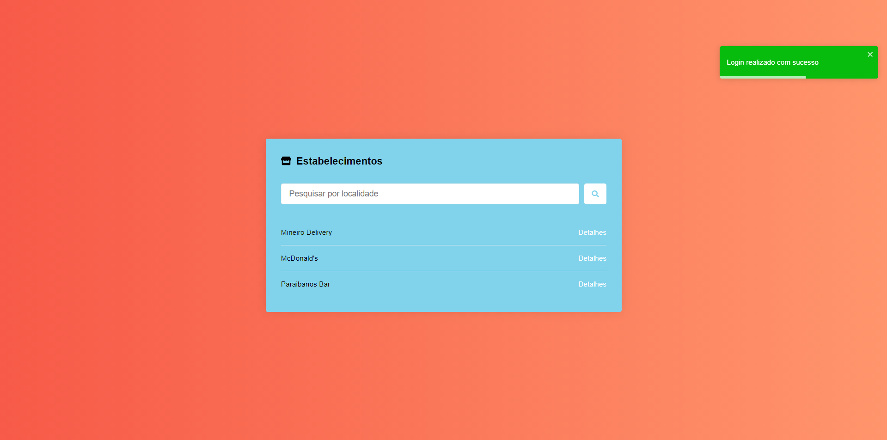

# Establishment Manager

#### Funcionalidades

- Login (autenticação de usuário) com Google
- Listagem de repositórios

# Tecnologias

- ReactJS
- Axios
- Styled Components
- Context Api

## Run

yarn &&
yarn start
